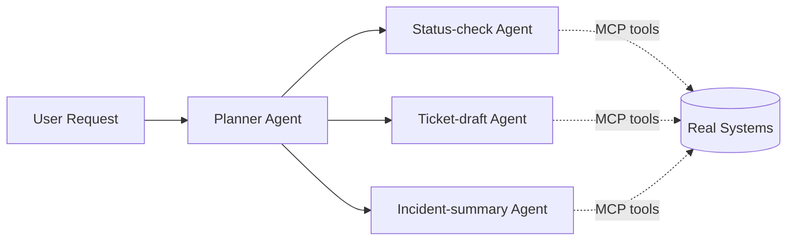

# 🤝 Sidekick — Multi-Agent Ops Assistant

  

> 💡 **One assistant, ops-scoped, that routes work instead of pretending to do everything itself.**



---

**AI Expert Core Tracks — Track 5 of 6: AI Engineer Agentic.** A multi-agent personal/ops assistant with real MCP tool use, built while working through *AI Engineer Agentic Track: The Complete Agent & MCP Course* (Weeks 1–6) — scoped toward platform/on-call use instead of a general-purpose assistant.

## 🧩 Sub-projects
- **`week1-2-agent-foundations/`** — core agent loop, tool-calling, memory basics
- **`week3-4-mcp-integration/`** — MCP servers connecting the agent to real tools (calendar, ticketing, infra status)
- **`week5-multi-agent/`** — a planner agent delegating to specialist sub-agents
- **`week6-deployment/`** — the assembled assistant deployed as a running service, not a local script

## 🚀 Capstone
A deployed multi-agent assistant that manages ops-relevant tasks — check a service's status, draft a ticket, summarize open incidents — through a Gradio/Next UI, with a planner agent routing each request to the right specialist sub-agent via MCP.

## ⚡ Quickstart
```bash
git clone <your-fork-url> && cd sidekick
cp .env.example .env
./scripts/setup.sh
./scripts/dev.sh
```

## 🗺️ Roadmap
- [ ] Agent loop + memory working
- [ ] 2+ MCP tools integrated
- [ ] Planner + 2–3 specialist sub-agents
- [ ] Deployed (even single-instance) as a running service
- [ ] UI usable by someone who isn't you

## 📈 At 10x Scale, I'd
Add per-sub-agent rate limiting so one noisy tool can't starve the planner, persist conversation/task state outside the process so a restart doesn't lose context, and add a permissions layer so not every MCP tool is reachable by every request.

## 🔍 Originality vs. the Course
The course builds general agent + MCP skills across the 6-week arc; this repo scopes the assistant specifically to ops/on-call tasks and ships it as a deployed service — the productization step, feeding directly into Track 6's production work.

## 📄 License
MIT – see `LICENSE`.
